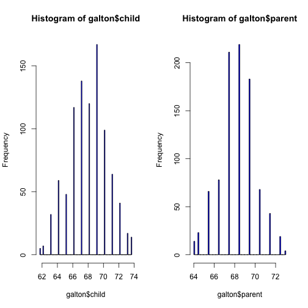

Week#1 
========================================================
Galton's Data


```r
library(UsingR)
```

```
## Loading required package: MASS
```

```r
data(galton)
```


```r
par(mfrow = c(1, 2))
hist(galton$child, col = "blue", breaks = 100)
hist(galton$parent, col = "blue", breaks = 100)
```

 


Finding the middle via Least Squares 

```r
library(manipulate)
myHist <- function(mu) {
    hist(galton$child, col = "blue", breaks = 100)
    lines(c(mu, mu), c(0, 150), col = "red", lwd = 5)
    mse <- mean((galton$child - mu)^2)
    text(63, 150, paste("mu  =", mu))
    text(63, 140, paste("MSE  =", round(mse, 2)))
}

manipulate(myHist(mu), mu = slider(62, 74, step = 0.5))
```

```
## Error: no such symbol rs_createUUID
```


```r
par(mfrow = c(1, 1))
hist(galton$child, col = "blue", breaks = 100)
meanChild <- mean(galton$child)
lines(rep(meanChild, 100), seq(0, 150, length = 100), col = "red", lwd = 5)
```

 


