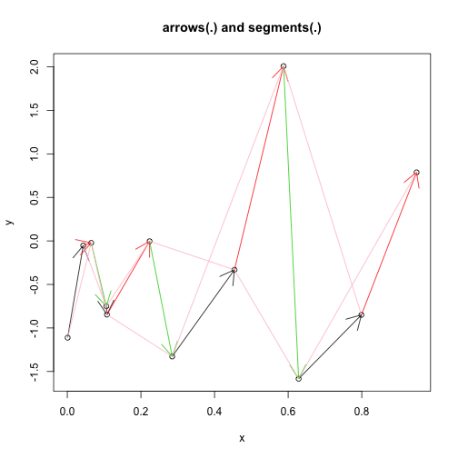

Regression Models: Week#2 
========================================================
Example # 2: Linear Regression Model on Diamonds dataset

Data is diamond prices (Signapore dollars) and diamond weight in carats (standard measure of diamond mass, 0.2 g). 


```r
# ls() rm(list = ls())
```


```r
library(UsingR)
```

```
## Loading required package: MASS
```

```r
data(diamond)
plot(diamond$carat, diamond$price, xlab = "Mass (carats)", ylab = "Price (SIN $)", 
    bg = "lightblue", col = "black", cex = 1.1, pch = 21, frame = FALSE)

abline(lm(price ~ carat, data = diamond), lwd = 2)
```

 


You can also embed plots, for example:
Fitting the linear regression model. 


```r
fit <- lm(price ~ carat, data = diamond)
coef(fit)
```

```
## (Intercept)       carat 
##      -259.6      3721.0
```


* We estimate an expected 3721.02 (SIN) dollar increase in price for every carat increase in mass of diamond.

* The intercept -259.63 is the expected price of a 0 carat diamond.

##Getting a more interpretable intercept 


```r
fit2 <- lm(price ~ I(carat - mean(carat)), data = diamond)
coef(fit2)
```

```
##            (Intercept) I(carat - mean(carat)) 
##                  500.1                 3721.0
```


```r
help(package = "graphics")
```


```r
names(par())
```

```
##  [1] "xlog"      "ylog"      "adj"       "ann"       "ask"      
##  [6] "bg"        "bty"       "cex"       "cex.axis"  "cex.lab"  
## [11] "cex.main"  "cex.sub"   "cin"       "col"       "col.axis" 
## [16] "col.lab"   "col.main"  "col.sub"   "cra"       "crt"      
## [21] "csi"       "cxy"       "din"       "err"       "family"   
## [26] "fg"        "fig"       "fin"       "font"      "font.axis"
## [31] "font.lab"  "font.main" "font.sub"  "lab"       "las"      
## [36] "lend"      "lheight"   "ljoin"     "lmitre"    "lty"      
## [41] "lwd"       "mai"       "mar"       "mex"       "mfcol"    
## [46] "mfg"       "mfrow"     "mgp"       "mkh"       "new"      
## [51] "oma"       "omd"       "omi"       "page"      "pch"      
## [56] "pin"       "plt"       "ps"        "pty"       "smo"      
## [61] "srt"       "tck"       "tcl"       "usr"       "xaxp"     
## [66] "xaxs"      "xaxt"      "xpd"       "yaxp"      "yaxs"     
## [71] "yaxt"      "ylbias"
```


```r
curve(5 * x^2)
```

 


```r
curve(5 * x^3, add = T)
```

```
## Error: plot.new has not been called yet
```


```r
curve(5 * x^5, add = T)
```

```
## Error: plot.new has not been called yet
```


```r
`?`(curve)
```


```r
example(arrows)
```

```
## 
## arrows> x <- stats::runif(12); y <- stats::rnorm(12)
## 
## arrows> i <- order(x, y); x <- x[i]; y <- y[i]
## 
## arrows> plot(x,y, main = "arrows(.) and segments(.)")
```

 

```
## 
## arrows> ## draw arrows from point to point :
## arrows> s <- seq(length(x)-1)  # one shorter than data
## 
## arrows> arrows(x[s], y[s], x[s+1], y[s+1], col = 1:3)
## 
## arrows> s <- s[-length(s)]
## 
## arrows> segments(x[s], y[s], x[s+2], y[s+2], col = "pink")
```


